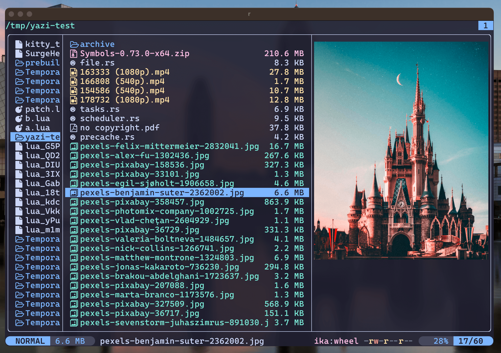

<div align="center">
  
</div>

<h3 align="center">
	Catppuccin Mocha Flavor for <a href="https://github.com/sxyazi/yazi">Yazi</a>
</h3>

## Preview



## Install

```sh
ya pkg add yazi-rs/flavors:catppuccin-mocha
```

## Configure

Set the dark flavor in `theme.toml`:

```toml
[flavor]
dark = "catppuccin-mocha"
```

To override this flavor, add the relevant settings to `theme.toml` after
`[flavor]`. Otherwise, keep only the `[flavor]` section.

See the [Yazi flavor documentation](https://yazi-rs.github.io/docs/flavors/overview)
for the available settings.

## License

The flavor is MIT-licensed, and the included tmTheme is also MIT-licensed.

See [LICENSE](LICENSE) and [LICENSE-tmtheme](LICENSE-tmtheme).
